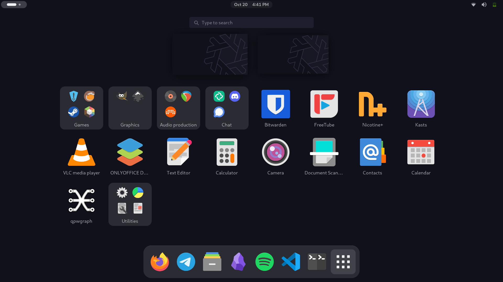
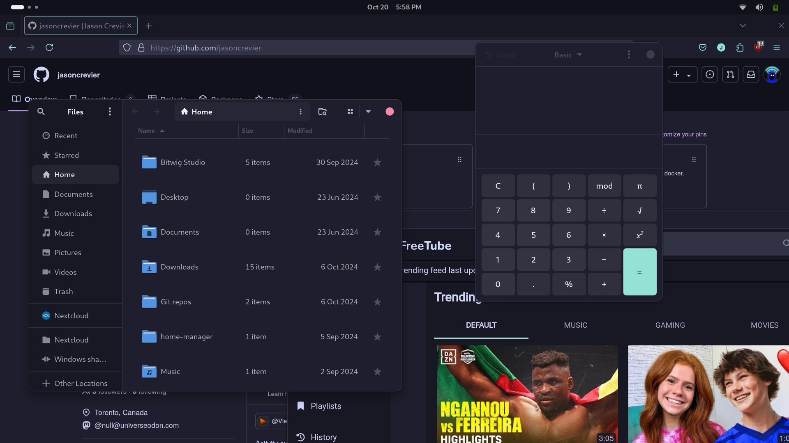
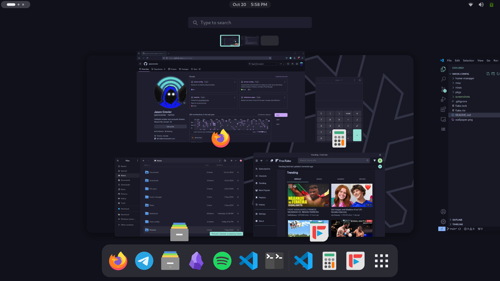
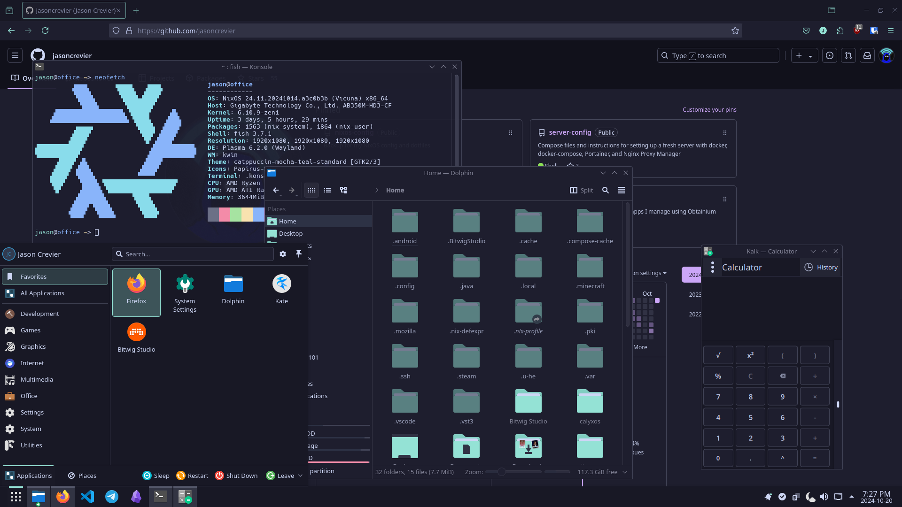

# My NixOS config
This is where I store the config files and dotfiles for my NixOS setup. I'm new to Nix in general, so there's a lot of tinkering and experimentation happening in this space.
A lot of it is still very noob-ish, so if you stumble on this repo and have any advice, I'd love to hear it!

## Structure
```console
nixos-config
├── home-manager
│   └── device-configs
├── misc
│   └── .config
│       └── presets
│   └── .local
│       └── share
│          ├── applications
│          ├── color-schemes
│          └── konsole
├── nixos
│   └── device-configs
└── pkgs
```
- `nixos-config`: Includes the main flake for all the NixOS devices in my fleet, my wallpaper, and all the sub-directories below.
- `home-manager`: Separate config files for `home-manager`. A main config file for each device that import any of the other config files from the folder that are relevant to that machine.
- `misc`: A handful of files to copy to the home directory after install. They're mostly for theming. I'll eventually add them to `home-manager` or use something like `stylix` to handling theming declaratively.
- `nixos`: Separate `configuration.nix` files for each device. They each import their relevant `hardware-configuration.nix` and any of the other config files from the folder that are relevant to that machine. Most machines will import `common.nix` which contains basic applications and configs like enabling `systemd-boot`, setting the time zone, installing `git`, etc.
- `pkgs`: Derivations for packages that aren't available in the `nixpkgs` repos.


## Devices
### Thinkpad
Specs:
- Model: Lenovo ThinkPad T470
- Processor: Intel® Core™ i5-7300U
- Graphics: Intel® HD Graphics 620
- Memory: 16 GB
- Storage: 256 GB

System:
- Desktop environment: Gnome 46
- Window manager: Wayland
- Shell: fish
- Theme: Catppuccin Mocha

<details>
<summary>Screenshots</summary>




</details>
### Office workstation

<details>
<summary>Screenshots</summary>


</details>